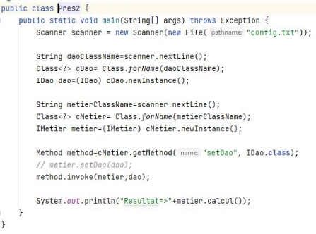

***Compte Rendu **Activité Pratique 1* 

Inversion de Contrôle et  Injection des Dépendances

***4IIR MIAGE G1 - Maarif ***

Réalisé par **: DADDA Farouk** 

***Énoncé***  

1- Créer l’interface IDao.  

2- Créer une implémentation de cette interface.  3- Créer l’interface Metier.  

4- Créer une implémentation de cette interface.  

5- Créer la couche Présentation en faisant l’injection 

des dépendances : 

a- Par Instanciation statique  

b- Par Instanciation dynamique  c- En utilisant Spring :  

- XML  
- Annotations  

***Conception et Architecture*** 

***Lien Repo Git Hub*** 

[https://github.com/DaddaFarouk/Activite-](https://github.com/DaddaFarouk/Activite-Pratique-1-JEE)

[Pratique-1-JEE ](https://github.com/DaddaFarouk/Activite-Pratique-1-JEE)

**1-  Interface IDao** : 

**2-  Implémentation IDao :** 

**3-  Interface Metier :** 

**4-  Implémentation Metier :** 

**5-  Couche Présentation**  

***a-  Instanciation Statique :*** 

***b-  Instanciation Dynamique :***  

***c-  Spring***  

- *XML :* 

- *Annotations :* 

